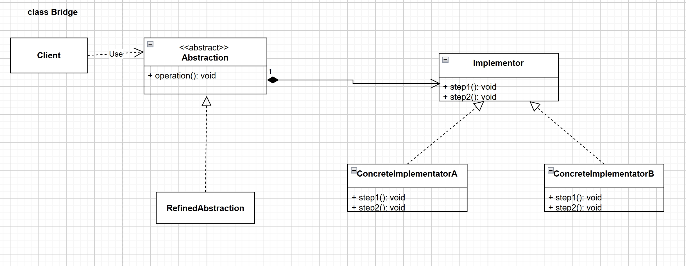

# DESIGN-PATTERNS

## Solid Design Principles
* Single Responsibility Principle
* Open Closed Principle
* Liskov Substitution Principle
* Interface Segregation Principle
* Dependency Inversion Principle

### Single Responsibility Principle
* There should never be more than one reason for a class to change 
* A class focused single functionality, it addresses a specific concern of the desired functionality
* Example:
  * A class is creating and sending a message to a remote server
  * reasons for this class to change:
    * Communication protocol changes - HTTP to HTTPS
    * Message format changes - JSON to XML
    * Parameters of communication - authentication is added
  * three separate responsibilities, we should have three separate class for each of them
* Hands-on
  * The UserController is supposed to receive the user requests and pass them to the rest of the application; then it gets the result of the processing and send the response back
  * Our UserController violates single responsibility principle
    * creating User object from the request
    * Validating User object
    * storing the User object
    * implementation: https://github.com/GongVictorFeng/Design-Patterns/commit/6085e65411b28e83478b65c9b12ecdad2cb26890
  * Refactoring:
    * creating a UserValidator to validate user: https://github.com/GongVictorFeng/Design-Patterns/commit/c1ed54106d983a7b9120a5585cd51d176a63e440
    * creating a UserPersistenceService to talk to the user data store: https://github.com/GongVictorFeng/Design-Patterns/commit/0ffd2b51dde3ae78dd00c0a192a791eef2eecb50
    * creating a UserMapper to convert userJson to User object: https://github.com/GongVictorFeng/Design-Patterns/commit/ebefa1d069f535532466917fcc3b327679c290ad

### Open-Closed Principle
* Software entities (Classes, Modules, Methods,...) should be open for extension, but closed for modification
* Open for extension - extend existing behaviour
* Closed for modification - existing code remains unchanged
* Example:
  * A base class which is already written and tested, we can use inheritance to extend or modify behaviour of methods in base class
  * We should not modify the code which is written in the base class
* Hands-on
  * There are many duplicated attributes between PhoneSubscriber and ISPSubscriber: 
    * https://github.com/GongVictorFeng/Design-Patterns/commit/b4d840f9ae8c349b7c7b0b09f1812d56625e4bd2
    * https://github.com/GongVictorFeng/Design-Patterns/commit/b4d840f9ae8c349b7c7b0b09f1812d56625e4bd2
  * Created a base class - Subscriber which is closed to modification, and method calculateBill is open for extension
    * https://github.com/GongVictorFeng/Design-Patterns/commit/0bb60b2b0a2b57d092a97a45754469518173e3ee
  * Both PhoneSubscriber and ISPSubscriber extends from base class to reuse the code and override the method calculateBill
    * https://github.com/GongVictorFeng/Design-Patterns/commit/e33c44fc2145a1f044c764de331668f91ee01c72

### Liskov Substitution Principle
* We should be able to substitute base class object with child class object and this should not alter behavior or characteristics of program
* Hands-on:
  * Since Square is a rectangle, so it extends from Rectangle.
  * To keep square a square, whenever the width is set, the height should also be set to the same number, vise versa.
  * https://github.com/GongVictorFeng/Design-Patterns/commit/5abe24f5179c9b75ddb4f6bf5940db469503250a
  * Square failed in the test case: https://github.com/GongVictorFeng/Design-Patterns/commit/d497a4a9157c08990cad606f7816aad6a6f4a2ef
    * Square modified the behavior of its base class - Rectangle, which violated the liskov principle
  * Created an interface - Shape, then both Rectangle and Square implement it and override the computeArea method
    * https://github.com/GongVictorFeng/Design-Patterns/commit/7d5185a2cacfd4eec7b85e4bda3050c608515e40
    * https://github.com/GongVictorFeng/Design-Patterns/commit/f4e6b0c3d9b2e1836e9cd3af6256df9931932af9
    * https://github.com/GongVictorFeng/Design-Patterns/commit/c956a7437933ea85a40bb19daa829cc4a883aaa8

### Interface Segregation Principle
* Clients should not be forced to depend upon interfaces that they do not use
* Clients should not have to depend on methods that are defined in interfaces that they don't use
* Interface Pollution - We should not cram methods that are unrelated in a big interface and make all other classes in our software system or in our module implement that interface
  * Signs of Interface Pollution 
    * Classes have empty method implementations
    * Method implementations throw UnsupportedOperationException (or similar)
    * Method implementations return null or default/dummy values
* Break bigger interfaces so that methods or behaviors or contracts are defined in a particular interface are cohesive
* Hands-on:
  * The Interface PersistenceService has a method called findByName: https://github.com/GongVictorFeng/Design-Patterns/commit/b33c59e7b9603dffbda50406184f2ccd74176692
  * The User has the name, but the order does not have the name
    * https://github.com/GongVictorFeng/Design-Patterns/commit/b1df341a28fd677eaeac4df2658627c429d91bb8
    * https://github.com/GongVictorFeng/Design-Patterns/commit/a88bbdcb3d47912c545c0116ac0f0623fbdee0b1
  * the method findByName in OrderPersistenceService does not make sense: https://github.com/GongVictorFeng/Design-Patterns/commit/3e5c26d959b477848508b1259fea6409396e5051
  * Removed the findByName method in PersistenceService, so that the OrderPersistenceService should not force to override this method: https://github.com/GongVictorFeng/Design-Patterns/commit/053de0d1664dd97286c3f22e5a7a00afd2861a76

### Dependency Inversion Principle
* High level Modules should not depend on low level modules. Both should depend on abstraction
* Abstraction should not depend on details, details should depend on abstraction
* High level Module means a module provides or implements some business rules
* Low level Module is a functionality that is so basic that it can be used anywhere
* Hands-on:
  * There are two dependencies in MessagePrinter, JSONFormatter and PrintWriter: https://github.com/GongVictorFeng/Design-Patterns/commit/4219edb308a83b7b284dabaa2d7b15356f455a51
  * If we want to print this message on console, then current method is not working, need to create another method to use `System.out` instead of `PrintWriter`
  * If we want to change the format other than JSON, we have to modify this method and change JSONFormatter to Other Formatter
  * It violates the Dependency inversion, High level depends on Low level
  * used dependency injects to make the method - writeMessage depends on abstract and only contains business rule
    * https://github.com/GongVictorFeng/Design-Patterns/commit/af8e0ae34261a5d22a0f6aa662140d6635061eca

## Design Patterns
* Creational - Creational Patterns deal with the process of creating objects of classes
* Structural - Structural patterns deal with how classes and objects are arranged or composed
* Behavioral - Behavioral patterns describe how classes and objects interact and communicate with each other

### Creational Patterns
* The need of creational patterns - why not use new operator
* new operator is needed + multiple additional requirements
  * The object needs multiple other objects before it can be created
  * There may be multiple steps before creating an object
  * There may be only one object in the entire application

#### Builder
* The object of the class must be immutable
  * Class constructor requires a lot of information
* Objects that need other objects or "parts" to construct them
* We have a complex process to construct an object involving multiple steps, then builder design pattern can help us
* In builder, we remove the logic related to object construction from "client" code and abstract it in separated classes
* UML: 
  * Product - final complex object that we want to create
  * Builder - Provides interface for creating "parts" of the product
    * provides a method - build() to assemble the final object
    * provides a method - getProduct to query already built object
  * Concrete Builder - Constructs parts and assembles final product and keeps track of product it creates
  * Director - Uses builder to construct object and knows the steps and their sequence to build product
* Implement a Builder
  * Start by creating a builder
    * Identify the "parts" of the product and provide methods to create those parts
    * It should provide a method to "assemble" or build the product/object
    * It must provide a way/method to get fully built object out. Optionally builder can keep reference to a product it has built so the same can be returned again in future
  * A director can be a separate class or client can play the role of director
* Hands-on:
  * UML: 
  * Create Builder and Base class of final product: https://github.com/GongVictorFeng/Design-Patterns/commit/ce6ca5f5c2a65d8ba09b1b8269f20789277e09b4
  * Create concrete Builder: https://github.com/GongVictorFeng/Design-Patterns/commit/fa0c75180431721f6efa61adfe1f065596a51939
  * Create Client and Director: https://github.com/GongVictorFeng/Design-Patterns/commit/c8cc511716ef24f9416a6c354a91c96ba1699159
* Implementation Considerations
  * You can easily create an immutable class by implementing builder as an inner static class. You'll find this type of implementation used quite frequently even if immutability is not a main concern
* Design Considerations
  * The director role is rarely implemented as separate class, typically the consumer of the object instance or the client handles that role
  * Abstract builder is also not required if "product" itself is not part of any inheritance hierarchy. You can directly create concrete builder
  * If you are running into a "too many constructor arguments" problem then it is a good indication that builder pattern may help
* Real world example - java.util.Calendar.Builder
* Pitfalls
  * A little bit complex for newcomers mainly because of "method chain" where builder methods return builder object itself
  * Possibility of partially initialized object; user code can set only a few or none of properties using `withXXX` methods and call build(). If required properties are missing, build method should provide suitable defaults or throw exception

#### Simple Factory
* Multiple types can be instantiated and the choice is based on some simple criteria
* We simply move the instantiation logic to a separate class and most commonly to a static method of this class
* Some do not consider simple factory to be a "design pattern", as it is a simple method that encapsulates object instantiation. Nothing complex goes on in that method
* Typically, we want to do this if we have more than one option when instantiating object and a simple logic is used to choose correct class 
* UML:
  * Product - Object of this class and its subclasses
  * Simple Factory - Provides a static method to get instance of product subclass
* Implementation
  * We start by creating a separate class for simple factory
    * Add a method which returns desired object instance
      * This method is typically static and will accept some argument to decide which class to instantiate
      * You can also provide additional arguments which will be used to instantiate objects
* Hands-on
  * Created abstract product: https://github.com/GongVictorFeng/Design-Patterns/commit/c4b090708fe4526af667ca0e49ba956ed1a361f4
  * Created the subclasses of the product: https://github.com/GongVictorFeng/Design-Patterns/commit/ba96be856884d5cff45cd5a77266fbba64efee1f
  * Created the class of simple factory and the method to get desired object instance: https://github.com/GongVictorFeng/Design-Patterns/commit/f600ea96f80e043e280c638b5db69f707f2b1838
* Simple factory can be just a method in existing class. Adding a separate class allows other parts of code to use simple factory more easily
* Simple factory itself does not need any state tracking, so it's best to keep this as static method
* Simple factory will in turn may use other design pattern like builder to construct objects
* In case you want to specialize simple factory in subclasses, you need factory design pattern instead
* Real-world example: java.text.NumberFormat class has getInstance method, which is an example of simple factory
* Pitfalls
  * The criteria used by simple factory to decide which object to instantiate can get more convoluted/complex over time. If you find yourself in such situation then use factory design pattern

#### Factory
* We want to move the object creation logic from our code to a separate class
* We use this pattern when we do not know in advance which class we may need to instantiate beforehand and also to allow new classes to be added to system and handle their creation without affecting client code
* We let subclasses decide which object to instantiate by overriding the factory method
* UML:
  * Product - base class or interface of products created by factory method
  * Concrete Product - implements the product interface or extend the product base class
  * Creator - Declares the abstract factory method  and uses the factory method to create product
  * Concrete creator - implement factory method and return one of concrete product instance
* Implement a Factory Method
  * We start by creating a class for our creator 
    * Creator itself can be concrete if it can provide a default object, or it can be abstract
    * Implementations will override the method and return an object
* Hands-on:
  * UML: 
  * Created the abstract Message Class: https://github.com/GongVictorFeng/Design-Patterns/commit/ef1787a5114196c4b826fd73c2a906832acd6b3b
  * Created the concrete classes of the message class: https://github.com/GongVictorFeng/Design-Patterns/commit/1c3c28f668eba8c63e0200aa6883d971e41470ff
  * Created the abstract creator: https://github.com/GongVictorFeng/Design-Patterns/commit/48c6d669a7c650dad9743eca294326bcc738c541
  * Created the concrete creators: https://github.com/GongVictorFeng/Design-Patterns/commit/5879ac729e7803cac24a8b010a6fdc5f82959635
  * Created the client and test case for factory method: https://github.com/GongVictorFeng/Design-Patterns/commit/cba827524028a22d197bc8981cf73f6b85de4308
* Implement Consideration
  * The creator can be a concrete class and provide a default implementation for the factory method. In such cases you will create some "default" object in base creator
  * You can also use the simple factory way of accepting additional arguments to choose between different object types. Subclasses can then override factory method to selectively create different objects for some criteria
* Design Considerations
  * Creator hierarchy in factory method pattern reflects the product hierarchy. We typically end up with a concrete creator per object type
  * Template method design pattern often makes use of factory method
  * Abstract factory makes use of factory method as well
* Real-world example - Java.util.Collection has an abstract method called iterator()
* Pitfalls
  * More complex to implement. More classes involved and need unit test
  * You have to start with Factory method design pattern from the beginning. It's not easy to refactor existing code into factory method pattern
  * Sometimes this pattern forces you to subclass just to create appropriate instance

#### Prototype
* We have a complex object that is costly to create. To create more instances of such class, we use an existing instance as our prototype
* Prototype will allow us to make copies of existing object and save us from having to recreate objects from scratch
* UML: 
  * Prototype - declares a method for cloning itself
  * Concrete prototype - implements cloning method
  * Client - creates new instance using prototype's clone method
* Implement a Prototype
  * We start by creating a class which will be a prototype
    * The class must implement Cloneable interface
    * Class should override clone method and return copy of itself
    * The method should declare CloneNotSupportedException in throw clause to give subclass chance to decide on whether to support cloning
  * Clone method implementation should consider the deep and shallow copy and choose whichever is applicable
* Hands-on:
  * UML: 
  * Created the abstract prototype class: https://github.com/GongVictorFeng/Design-Patterns/commit/6a3c1a52980ae34025fbcf5db6a01073fa81d2ee
  * Created two concrete subclasses extend the prototype, one supports clone, another one is not: https://github.com/GongVictorFeng/Design-Patterns/commit/b57dde19fadb8684f414c294459910ba47e09537
  * Created client and test case: https://github.com/GongVictorFeng/Design-Patterns/commit/7625c549ade8a943bef8e1147d11872632c86413
* Implementation Considerations
  * Pay attention to the deep copy and shallow copy of references. Immutable fields on clones save the trouble of deep copy
  * Make sure to reset the mutable state of object before returning the prototype. It's good idea to implement this in method to allow subclasses to initialize themselves
  * clone() method is protected in Object class and must be overridden to be public  to be callable from outside the class
  * Cloneable is a "marker" interface, an indication that the class supports cloning
* Design Considerations
  * Prototypes are useful when you have large objects where majority of state is unchanged between instances, and you can easily identify that state
  * A prototype registry is a class where you can register various prototypes which other code can access to clone out instances This solves the issue of getting access to initial instance
  * Prototypes are useful when working with Composite and Decorator Patterns
* Real-world Example - Object.clone() method
  * This method is provided by Java and can clone an existing object, thus allowing any object to act as a prototype
  * Classes still need to be Cloneable but the method does the job of cloning object
* Pitfalls
  * Usability depends upon the number of properties in state that are immutable or can be shallow copied. An object where state is composed of large number of mutable object is complicated to clone
  * In java, the default clone operation will only perform the shallow copy so if you need a deep copy you have to implement it
  * Subclasses may not be able to support clone and so the code becomes complicated as you have to code for situations where an implementation may not support clone

#### Abstract Factory
* Abstract factory is used when we have two or more objects which work together forming a kit or set and there can be multiple sets or kits that can be created by client code
* We separate client code from concrete objects forming such a set and also from the code which creates these sets
* UML: 
  * Abstract Product - interface for a type of product
  * Concrete Product - implements the product interface or class
  * Abstract Factory - interface defining operations to create products
  * Concrete Factory - implement factory and creates products from a particular family
  * Client - uses abstract factory and abstract products
* Implement Abstract Factory
  * We start by studying the product "sets"
    * Create abstract factory as an abstract class or an interface
    * Abstract factory defines abstract methods for creating products
    * Provide concrete implementation of factory for each set of products
  * Abstract factory makes use of factory method pattern. You can think of abstract factory as an object with multiple factory methods
* Hands-on:
  * UML: 
  * Created the abstract factory: https://github.com/GongVictorFeng/Design-Patterns/commit/92f4915eb8ad283d01377b905c5e67012559692a
  * Created the abstract instance and the abstract storage: https://github.com/GongVictorFeng/Design-Patterns/commit/4a396e96de0e47b01beb441e0703572e45b75d4e
  * Created the concrete EC2 instance and GoogleComputeEngineInstance: https://github.com/GongVictorFeng/Design-Patterns/commit/eaf1da0bb54a9f2d7b0c134646573541a8c657b4
  * Created the concrete S3 Storage and GoogleCloudStorage: https://github.com/GongVictorFeng/Design-Patterns/commit/313a870c7d6bdcd423138838fecf0d2dcfe5756c
  * Created the factory implementation for AWS and Google cloud platform: https://github.com/GongVictorFeng/Design-Patterns/commit/4a6dcdc104a8e27e2f89e53418e83b0970f3b897
  * Created the client and test cases: https://github.com/GongVictorFeng/Design-Patterns/commit/35d8592c355d89493fdf8379e85062962a7e7849
* Implementation Considerations
  * Factories can be implemented as singletons, we typically ever need only one instance of it anyway. But make sure to familiarize yourself with drawbacks of singletons
  * Adding a new product type requires changes to the base factory as well as all implementations of factory
  * We provide the client code with concrete factory so that it can create objects
* Design Considerations
  * When you want to constrain object creations so that they all work together then abstract factory is good design pattern
  * Abstract factory uses factory method pattern
  * If objects are expensive to create then you can transparently switch factory implementations to use prototype design pattern to create objects
* Real-word example - javax.xml.parsers.DocumentBuilderFactory
* Pitfalls
  * A lot more complex to implement than factory method
  * Adding a new product requires changes to base factory as well as all implementations of factory
  * Difficult to visualize the need at start of development and usually starts out as a factory method
  * Abstract factory design pattern is very specific to the problem of "product families"

#### Singleton
* A singleton class has only one instance, accessible globally through a single point (via a method/field)
* Main problem this pattern solves is to ensure that only a single instance of this class exists
* Any state you add in your singleton becomes part of "global state" of your application
* UML: 
  * Singleton - responsible for creating unique instance and provides static method to get the instance
* Implement a Singleton
  * Controlling instance creation
    * Class constructors must not be accessible globally
    * Subclassing/inheritance must not be allowed
  * Keeping track of instance
    * Class itself is a good place to track the instance
  * Giving access to the singleton instance
    * A public static method is good choice
    * Can expose instance as final public static field, but it won't work for all singleton implementations
  * Two options for implementing a singleton
    * Early initialization - Eager Singleton
      * Create singleton as soon as class is loaded
    * Lazy initialization - Lazy Singleton
      * Singleton is created when it is first required
* Hands-on
  * Created the implementation of eager singleton: https://github.com/GongVictorFeng/Design-Patterns/commit/a357870cb909924ca6a8785d12b0c10e814d5512
  * Created the implementation of lazy singleton with double lock checking: https://github.com/GongVictorFeng/Design-Patterns/commit/0d165bfb847d9cf8af29a042133e1cdf4d86b09b
  * Created the implementation of lazy singleton with initialization holder: https://github.com/GongVictorFeng/Design-Patterns/commit/19b9157d4a74953cb2a133d43e9574f0a1e5206f
  * Created the implementation of singleton using enum: https://github.com/GongVictorFeng/Design-Patterns/commit/c0a43a10e155083cfdb1b8cc685555ae9d1aca45
* Implementation consideration
  * Early/Eager initialization is the simplest and preferred way. Always try to use this approach first
  * The "classic" singleton pattern implementation uses double check locking and volatile field
  * The lazy initialization holder idiom provides best of both worlds, you do not deal with synchronization issues directly and is easy to implement
  * You can also implement singletons using enum. However, due to pre-conceptions about what an enum is, it may be a hard sell during code review especially if singleton has mutable fields
  * If the simple solution works then use it
* Design Considerations
  * Singleton creation does not need any parameters. If you find yourself in need of support for constructor arguments, you need a simple factory or factory method pattern instead.
  * Make sure that your singleton are not carrying a lot of mutable global state
* Real-world example - java.lang.Runtime class in standard Java API is a singleton
* Pitfalls
  * Singleton pattern can deceive you about dependencies. Since they are globally accessible, it's easy to miss dependencies
  * They are hard to unit test. You cannot easily mock the instance that is returned
  * Most common way to implement Singletons in Java is through static variables, and they are held per class loader and not per JVM. So they may not be truly Singleton in an OSGi or web application
  * A singleton carrying around a large mutable global state is a good indication of an abused Singleton pattern

#### Object Pool
* In our system if cost of creating an instance of a class is high, and we need a large number of objects of this class for short duration, then we can use an object pool
* Here we either pre-create objects of the class or collect unused instances in an in-memory cache. When code needs an object of this class we provide it from the cache
* One of the most complicated patterns to implement efficiently
* UML: 
  * Object pool - Caches instances of reusable product and provide them
  * Abstract reusable product - Abstract product defining operation
  * Concrete reusable product - Implementation of reusable product with state
  * Client - Uses object pool to get instances of reusable product
* Implement object pool 
  * We start by creating class for object pool
    * A thread-safe caching of objects should be done in pool
    * Methods to acquire and release objects should be provided and pool should reset cached object before giving them out
  * The reusable object must provide methods to reset its state upon "release" by code
  * We have to decide whether to create new pooled objects when pool is empty or to wait until an object becomes available. Choice is influenced by whether the object is tied to a fixed number of external resources
* Hands-on
  * UML: 
  * Created abstract reusable: https://github.com/GongVictorFeng/Design-Patterns/commit/eec1f46f39c236321c2cbfe5c6639e3de0063277
  * Created concrete reusable: https://github.com/GongVictorFeng/Design-Patterns/commit/fb20d1972b0a555a0e8a7962bdae99c856814465
  * Created object pool: https://github.com/GongVictorFeng/Design-Patterns/commit/d7c9a409a067f5befd0994c3943050be6d185e3e
  * Created client and test cases: https://github.com/GongVictorFeng/Design-Patterns/commit/6fd467a6d935e9f4f2af0a94b22c7dd0faf4c7cb
* Implementation Consideration
  * Resetting object state should NOT be costly operation otherwise you may end up losing your performance savings.
  * Pre-cashing objects; meaning creating objects in advance can be helpful as it won't slow down the code using these objects. However, it may add-up to start up time and memory consumption.
  * Object pool's synchronization should consider the reset time needed and avoid resetting in synchronized context if possible
* Design Considerations
  * Object pool can be parameterized to cache and return multiple objects, and the acquire method can provide selection criteria
  * Pooling objects is only beneficial if they involve costly initialization because of initialization of external resource like a connection or a thread. Do not pool object JUST to save memory, unless you are running into out of memory errors.
  * Do not pool long-lived objects or only to save frequent call to new. Pooling may actually negatively impact performance in such cases.
* Real-world Example
  * java.util.concurrent.ThreadPoolExecutor is an example of object pool pattern which pools threads. Even though we can directly use this class, we will often use it via ExecutorService interface using method like Executors like newCachedThreadPool().
  * Class org.apache.commons.dbcp.BasicDataSource in dbcp package is an example of object pool pattern which pools database connections. This pool is commonly created and exposed via JNDI or as a Spring bean in applications.
* Pitfalls
  * Successful implementation depends on correct use by the client code. Releasing objects back to pool can be vital for correct working.
  * The reusable object needs to take care of resetting its state in efficient way. Some objects may not be suitable for pooling due to this requirement.
  * Difficult to use in refactoring legacy code as the client code and reusable object both need to be aware of object pool
  * You have to decide what happens when pool is empty and there is a demand for an object. You can either wait for an object to become free or create a new object. Both options have issues. Waiting can have severe negative impact on performance.
  * If you create new objects when code asks for an object and none are available then you have to do additional work to maintain or trim the pool size or else you'll end up with very large pool.

### Structural Design Pattern

Structural patterns deal with how classes and objects are arranged or composed

#### Adapter
* What is Adapter
  * We have an existing object which provides the functionality that client needs. But client code can not use this object because it expects an object with different interface
  * Using adapter design pattern we make this existing object work with client by adapting the object to client's expected interface
  * This pattern is also called as wrapper as it "wraps" existing object
* UML:
  * Class Adapter: 
    * Client - Needs functionality provided but as different interface than Adaptee
    * Target interface - Interface expected by client
    * Adapter - Adapts existing functionality to target interface
    * Adaptee - our existing class providing needed functionality
  * Object Adapter: 
    * Using composition instead of inheritance
* Implement an Adapter
  * We start by creating a class for Adapter
    * Adapter must implement the interface expected by client
    * First we are going to try out a class adapter by also extending from our existing class
    * In the class adapter implementation we are simply going to forward the method to another method inherited from adaptee
    * Next for object adapter, we are only going to implement target interface and accept adaptee as constructor argument in adapter i.e. make use of composition
  * An object adapter should take adaptee as an argument in constructor or as a less preferred solution, you can instantiate it in the constructor thus tightly coupling with a specific adaptee
* Hands-on:
  * UML:
    * 
    * 
  * Created adaptee: https://github.com/GongVictorFeng/Design-Patterns/commit/49f9bd09c09c4d5f104e5f6f33485dbb777f4a81
  * Created target interface: https://github.com/GongVictorFeng/Design-Patterns/commit/e3f1a9df50d2a0cb9d664883863d8204047655e4
  * Created client: https://github.com/GongVictorFeng/Design-Patterns/commit/45515499de923199f0ffddef9331b29fe81caca4
  * Created class adapter: https://github.com/GongVictorFeng/Design-Patterns/commit/3d5a331847bead8180d63414c74c5315ce25848e
  * Created object adapter: https://github.com/GongVictorFeng/Design-Patterns/commit/dd5f2b7301d1286e25ed7969d8dce145afa0ecbe
  * Created test cases: https://github.com/GongVictorFeng/Design-Patterns/commit/c841831a44443a7b250e691941b56d0f3508d75a
* Implementation Consideration
  * How much work the adapter does, depends upon the difference between target interface and object being adapted. If method arguments are same or similar, adapter has very less work to do.
  * Using class adapter "allows" you to override some of the adaptee's behavior. But this has to be avoided as you end up with adapter that behaves differently than adaptee. Fixing defects is not easy anymore
  * Using object adapter allows you to potentially change the adaptee object to one of its subclasses
* Design Considerations
  * In java a "class adapter" may not be possible if both target and adaptee are concrete classes. In such cases, the object adapter is the only solution. Also since there is no private inheritance in Java, It's better to stick with object adapter.
  * A class adapter is also called as a two-way adapter, since it can stand in for both the target interface and for the adaptee. That is we can use object of adapter where either target interface is expected as well as where an adaptee object is expected.
* Real-world example
  * The java.io.InputStreamReader and java.io.OutputStreamWriter class are examples of object adapters
  * These classes adapt existing InputStream and OutputStream object to a Reader/Writer interface
* Pitfalls
  * Using target interface and adaptee class to extend our adapter we can create a "class adapter" in java. However, it creates an object which exposes unrelated methods in parts of your code, polluting it. Avoid class adapters! It is mentioned here only for sake of completeness.
  * It is tempting to da a lot of things in adapter besides simple interface translation. But this can result in an adapter showing different behavior than the adapted object
  * Not a lot of other pitfalls! As long as we keep them true to their purpose of simple interface translation, they are good.

#### Flyweight
* Our system needs a large number of objects of a particular class and maintaining these instances is a performance concern.
* Flyweight allows us to share an object in multiple contexts. But instead of sharing entire object, which may not be feasible, we divide object state in two parts: intrinsic state - that is shared in every context, and extrinsic state - context specific state. We create objects with only intrinsic state and share them in multiple contexts.
* Client or user of object provides the extrinsic state to object to carry out its functionality
* We provide a factory so client can get required flyweight objects based on some key to identify flyweight
* UML: 
  * Flyweight - Interface for flyweight and method to receive extrinsic state
  * Concrete Flyweight - Has only intrinsic state; implements methods and uses provided extrinsic state
  * Unshared Flyweight - Object of these are not shared
  * Flyweight Factory - Provides instances of flyweights; take care of sharing
  * Client - Computes or stores extrinsic state of used flyweights
* Implementation a Flyweight
  * We start by identifying "intrinsic" and "extrinsic" state of our object
    * We create an interface for flyweight to provide common methods that accept extrinsic state
    * In implementation of shared flyweight we add intrinsic state and also implement methods
    * In unshared flyweight implementation, we simply ignore the extrinsic state argument as we have all state within object
  * Next we implement the flyweight factory which cashes flyweights and also provides method to get them
  * In our client we either maintain the extrinsic state or compute it on the run time when using flyweight
* Hands-on:
  * UML: 
  * Created the interface for flyweight: https://github.com/GongVictorFeng/Design-Patterns/commit/8e060e4d91a394a4c9fd6a84b4edabe4a9ae1dc5
  * Created implementation of shared flyweight: https://github.com/GongVictorFeng/Design-Patterns/commit/edae76bb707fdf00e0c17d4228386cd8aebe3b74
  * Created implementation of unshared flyweight: https://github.com/GongVictorFeng/Design-Patterns/commit/ec181258ee13e69123f9f2b86306c6c9c3e2e996
  * Created flyweight factory: https://github.com/GongVictorFeng/Design-Patterns/commit/2d8b7b47584e46a9d745c3700adf2f90186d949c
  * Created client and test cases: https://github.com/GongVictorFeng/Design-Patterns/commit/c07d908fc2b377081f9d4d3721c5b4d28cf1a701
* Implementation Considerations
  * A factory is necessary with flyweight design pattern as client code needs easy way to get hold of shared flyweight. Also number of shared instances can be large, so a central place is good strategy to keep track of all of them
  * Flyweight's intrinsic state should be immutable for successful use of flyweight pattern
* Design Considerations
  * Usability of flyweight is entirely dependent upon presence of sensible extrinsic state in object which can be moved out of object without any issue
  * Some other design patterns like state and strategy can make best use of flyweight pattern.
* Real-World Example:
  * Java uses flyweight pattern for Wrapper classes like java.lang.Integer, Short, Byte etc. Here the valueOf static method serves as the factory method.
  * String pool which is maintained by JVM is also an example of flyweight. We can call the intern() method on a String object to explicitly request this String object to be interned. This method will return a reference to already cached object if present or else will create new String in cache if not present.
* Pitfalls
  * Runtime cost may be added for maintaining extrinsic state. Client code has to either maintain it or compute it every time it needs to use flyweight.
  * It is often difficult to find perfect candidate objects for flyweight. Graphical applications benefit heavily from this pattern however a typical web application may not have a lot of use for this pattern.
#### Bridge Pattern
* Our implementation and abstractions are generally coupled to each other in normal inheritance
* Using bridge pattern we can decouple them so they can both change without affecting each other
* We achieve this feat by creating two separate inheritance hierarchies; one for implementation and another abstraction
* We use composition to bridge there two hierarchies
* UML: 
  * Abstraction - defines abstraction's interface; has reference to implementor
  * Refined Abstraction - More specialized abstraction
  * Implementor - Base interface for implementation classes; methods are unrelated to abstraction, and typically represent smaller steps needed
  * Concrete Implementor - Implements implementor methods
* Implement a Bridge
  * We start by defining our abstraction as needed by client
    * We determine common base operations and define them in abstraction
    * We can optionally also define a refined abstraction and provide more specialized operations
    * Then we define our implementor next. Implementor methods do Not have to match with abstraction. However, abstraction can carry out its work by using implementor methods.
    * Then we write one or more concrete implementor providing implementation
  * Abstractions are created by composing them with an instance of concrete implementor which it used by methods in abstraction
* Hands-on
  * UML: 
  * Created the abstraction and refined abstraction: https://github.com/GongVictorFeng/Design-Patterns/commit/9eb46c2880286631d3769e940354dc00e23b7201
  * Created the abstraction of implementor: https://github.com/GongVictorFeng/Design-Patterns/commit/5927ae54f4da8bd7af67e60a5849037058467f58
  * Created two concrete implementors: https://github.com/GongVictorFeng/Design-Patterns/commit/53a6f25d00084470af81007e79352eb2da6d68d8
  * Created the client and test cases: https://github.com/GongVictorFeng/Design-Patterns/commit/c26cd2ca1f5baf8d333ed7cef9339a0f60267579
* Implementation Considerations
  * In case we are ever going to have a single implementation, then we can skip creating abstract implementor
  * Abstraction can decide on its own which concrete implementor to use in its constructor, or we can delegate that decision to a third class. In last approach abstraction remains unaware of concrete implementors & provides greater de-coupling
* Design Considerations
  * Bridge provides great extensibility by allowing us to change abstraction and implementor independently. You can build & package them separately to modularize overall system
  * By using abstract factory pattern to create abstraction objects with correct implementation you can decouple concrete implementors from abstraction
* Real-world Example
  * An example of bridge pattern often given is the JDBC API. More specifically the java.sql.DriverManager class with the java.sql.DriverManager class with the java.sql.Driver interface form a bridge pattern
  * Another example of bridge pattern is the Collections.newSetFromMap() method. This method returns a Set which is backed by given map object.
* Pitfalls:
  * It is fairly complex to understand & implement bridge design pattern
  * You need to have a well-thought-out & fairly comprehensive design in front of you before you can decide on bridge pattern.
  * Needs to be designed up front. Adding bridge to legacy code is difficult. Even for ongoing project adding bridge at later time in development may require fair amount of rework
#### Decorator
* When we want to enhance behaviors of our existing object dynamically, then we can use decorator design pattern
* Decorator wraps an object within itself and provides same interface as the wrapped object. So the client of original object doesn't need to change
* A decorator provides alternative to subclassing for extending functionality of existing classes
* UML: 
  * Component - Defines interface used by client
  * Concrete Component - Plain object which can be decorated
  * Decorator - Provides additional behaviour; maintains reference to component
* Implement a Decorator
  * We start with our component
    * Component defines interface needed or already used by client
    * Concrete component implements the component
    * We define our decorator. Decorator implements component & also needs reference to concrete component
    * In decorator methods we provide additional behaviour on top that provided by concrete component instance
  * Decorator can be abstract as well & depend on subclasses to provided functionality
* Hands-on:
  * UML: 
  * Created the components with interface needed: https://github.com/GongVictorFeng/Design-Patterns/commit/bb9cf3bd6d9d59aebfbdf35bbdcc2dbaa8a828ff
  * Created concrete component which implements the component: https://github.com/GongVictorFeng/Design-Patterns/commit/81c6b4548be41348ce08e172a748f34f03d97ab5
  * Created two decorators: https://github.com/GongVictorFeng/Design-Patterns/commit/574ad2e29be577310474e3aac3ec3b433cd538a4
  * Created the client and test cases: https://github.com/GongVictorFeng/Design-Patterns/commit/d3cc2170c745244f554f7e0423644ffc349ef19c
* Implementation Consideration:
  * Since we have decorators and concrete classes extending from common component, avoid large state in this base class as decorators may not need all that state
  * Pay attention to equals and hasCode methods of decorator. When using decorators, you have to decide if decorated object is equal to the same instance without decorator
  * Decorators support recursive composition, and so this pattern lends itself to the creation of lots of small objects that add "just a little bit" functionality. Code using these objects becomes difficult to debug.
* Design Considerations:
  * Decorators are more flexible and powerful than inheritance. Inheritance is static by definition but decorators allow you to dynamically compose behaviour using objects at runtime
  * Decorators should act like additional skin over your object. They should add helpful small behaviours to object's original behaviours. Do not change meaning of the operations.
* Real-world Example:
  * Classes in Java's I/O package are great examples of decorator pattern
  * For example the java.io.BufferedOutputStream class decorates any java.io.OutputStream object and adds buffering to file writing operation. This improves the disk i/o performance by reducing number of writes
  * UML: 
* Pitfalls:
  * Often results in large number of classes being added to system, where each class adds a small amount of functionality. You often end up with lots of objects, one nested inside another and so on.
  * Sometimes newcomers will start using it as a replacement of inheritance in every scenario, Think of decorators as a thin skin over existing object

#### Composite
* We have a part-whole relationship or hierarchy of objects, and we want to be able to treat all objects in this hierarchy uniformly.
* This is NOT a simple composition concept from object-oriented programming but a further enhancement to that principle
* Think of composite pattern when dealing with tree structure of objects
* UML: 
  * Component - Defines behavior common to all classes including method to access children
  * Composite - Stores child components
  * Leaf - Represents leaf objects & behaviors of primitive objects
  * Client - Works with object hierarchy using component interface only
* Implement a Composite
  * We start by creating an abstract class interface for Component
    * Component must declare all methods that are applicable to both leaf and composite
    * We have to choose where to define the children management operations, component or composite
    * Then we implement the composite. An operation invoked on composite is propagated to all its children
    * In leaf nodes we have to handle the non-applicable operations like add/remove a child if they are defined in component
  * In the end, a composite pattern implementation will allow you to write algorithms without worrying about whether node is leaf or composite
* Hands-On:
  * UML: 
  * Created the abstract class or interface for component: https://github.com/GongVictorFeng/Design-Patterns/commit/bfe7ea45ac36c4ea8ff55d94493fc82401e512a0
  * Created the leaf node in composite pattern: https://github.com/GongVictorFeng/Design-Patterns/commit/55273b6c1d74bce0406d3967f4a2100a617c88f7
  * Created the composite in composite pattern: https://github.com/GongVictorFeng/Design-Patterns/commit/7610b0811bd4151a982bdb07bf1620f8b032d860
  * Created the client and the test cases: https://github.com/GongVictorFeng/Design-Patterns/commit/6106094bec5d71834a889cc662ed7245f14eae25
* Implementation Considerations
  * You can provide a method to access parent of a node. This will simplify traversal of the entire tree
  * You can define the collection field to maintain children in base component instead of composite but again that field has no use in leaf class
  * If leaf objects can be repeated in the hierarchy, then shared leaf nodes can be used to save memory and initialization costs. But again the number of nodes is major deciding factor as using a cache for small total number of nodes may cost more
* Design Considerations
  * Decision needs to be made about where child management operations are defined. Defining them on component provides transparency but leaf nodes are forced to implement those methods. Defining them on composite is safer but client needs to be made aware of composite
  * Overall goal of design should be to make client code easier to implement when using composite. This is possible if client code can work with component interface only and doesn't need to worry about leaf-composite distinction
* Real-World Example
  * Composite is used in many UI frameworks, since it easily allows to represent a tree of UI controls
  * In JSF, we have UIViewRoot class which acts as composite. Other UIComponent implementations like UIOutput, UIMessage act as leaf nodes
  * UML: 
* Pitfalls
  * Difficult to restrict what is added to hierarchy. If multiple types of leaf nodes are present in system then client code ends up doing runtime checks to ensure the operation is available on a node
  * Creating the original hierarchy can still be complex implementation especially if you are using caching to reuse nodes and number of nodes are quite high

#### Facade
* Client has to interact with a large number of interfaces and classes in a subsystem to get result. So client gets tightly coupled with those interfaces & classes. Facade solves this problem
* Facade provides a simple and unified interface to a subsystem. Client interacts with just the facade now to get the same result
* Facade is NOT just a one to one method forwarding to other classes
* UML: 
  * Facade - Interacts with subsystem classes to satisfy client request
  * Subsystem classes - These classes together implement functionality
* Implement a Facade
  * We start by creating a class that will serve as a facade
    * We determine the overall "use cases"/tasks that the subsystem is used for
    * We write a method that exposes each "use case" or task
    * This method takes care of working with different class of subsystem